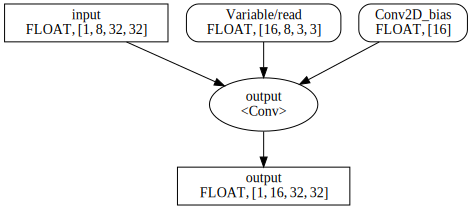

Lightweight Command Line Toolbox for ONNX
=========================================

[](https://github.com/jackwish/onnxcli/actions?query=workflow%3A%22Build+and+Test%22)
[](https://github.com/jackwish/onnxcli/actions?query=workflow%3ASanity)
[](https://codecov.io/gh/jackwish/onnxcli)


* Aims to improve your development or usage experience of ONNX.
* Serves as a CLI wrapper for most cases.
* Use it like `onnx infershape /path/to/model.onnx`.


## Installation

Recommand to install via [GitHub repo][github] with [virtualenv](https://virtualenv.pypa.io)
```
pip install git+https://github.com/jackwish/onnxcli.git
```

Two alternative ways of installing the package are:
1. Install via [pypi package][pypi] `pip install onnxcli`
2. Download and add the code tree to your `$PYTHONPATH`. This is for development purpose since the command line is different.
    ```
    git clone https://github.com/jackwish/onnxcli.git
    export PYTHONPATH=$(pwd)/onnxcli:${PYTHONPATH}
    python onnxcli/cli/dispatcher.py <more args>
    ```

The [`onnx draw`](#draw) requires [`dot` command (graphviz)](https://graphviz.org/) to be avaiable on your machine.
It can be installed by command as below on Ubuntu/Debian.
```
sudo install -y graphviz
```


## Usage

Once installed, the `onnx` and `onnxcli` commands are avaiable on your machine.
And you can play with commands such as `onnx infershape /path/to/model.onnx`.
The sub commands of this tool are as below.
_This tool is under construction, check the online help with `onnx --help` and `onnx <subcmd> --help`._

### infershape

`onnx infershape` performs [shape inference](https://github.com/onnx/onnx/blob/master/docs/ShapeInference.md) of the ONNX model.
It's an CLI wrapper of [`onnx.shape_inference`](https://github.com/onnx/onnx/blob/master/docs/PythonAPIOverview.md#running-shape-inference-on-an-onnx-model).
You will find it useful to generate shape information for the models that are extracted by [`onnx extract`](#extract)

### extract

`onnx extract` extracts the sub model that are determined by the names of the input and output tensor of the it from the original model.
It's a CLI wrapper of [`onnx.utils.extract_model`](https://github.com/onnx/onnx/blob/master/docs/PythonAPIOverview.md#extracting-sub-model-with-inputs-outputs-tensor-names)

### inspect

`onnx inspect` gives you a quick view of the information of the given model.
It's inspired by [the tf-onnx tool](https://github.com/onnx/tensorflow-onnx/blob/master/tools/dump-onnx.py).

When working on deep learning, you may like to take a look at the model.
[Netron](https://github.com/lutzroeder/netron) is powerful but doesn't provide fine-grain view.

With `onnx inspect`, you no longer need to scroll the Netron window to look for the node.
You can even dump the node attributes and tensor values with a single command.

<details><summary>Click here to see a node example</summary>
<pre><code>
$ onnx inspect ./assets/tests/conv.float32.onnx --node --indices 0 --detail

Inpect of model ./assets/tests/conv.float32.onnx
  Graph name: 9
  Graph inputs: 1
  Graph outputs: 1
  Nodes in total: 1
  ValueInfo in total: 2
  Initializers in total: 2
  Sparse Initializers in total: 0
  Quantization in total: 0

Node information:
  Node "output": type "Conv", inputs "['input', 'Variable/read', 'Conv2D_bias']", outputs "['output']"
    attributes: [name: "dilations"
ints: 1
ints: 1
type: INTS
, name: "group"
i: 1
type: INT
, name: "kernel_shape"
ints: 3
ints: 3
type: INTS
, name: "pads"
ints: 1
ints: 1
ints: 1
ints: 1
type: INTS
, name: "strides"
ints: 1
ints: 1
type: INTS
]
</code></pre>
</details>

<details><summary>Click here to see a tensor example</summary>
<pre><code>
$ onnx inspect ./assets/tests/conv.float32.onnx --tensor --names Conv2D_bias --detail

Inpect of model ./assets/tests/conv.float32.onnx
  Graph name: 9
  Graph inputs: 1
  Graph outputs: 1
  Nodes in total: 1
  ValueInfo in total: 2
  Initializers in total: 2
  Sparse Initializers in total: 0
  Quantization in total: 0

Tensor information:
  Initializer "Conv2D_bias": type FLOAT, shape [16],
    float data: [0.4517577290534973, -0.014192663133144379, 0.2946248948574066, -0.9742919206619263, -1.2975586652755737, 0.7223454117774963, 0.7835700511932373, 1.7674627304077148, 1.7242872714996338, 1.1230682134628296, -0.2902531623840332, 0.2627834975719452, 1.0175092220306396, 0.5643373131752014, -0.8244842290878296, 1.2169424295425415]
</code></pre>
</details>

### draw

`onnx draw` draws the graph in `dot`, `svg`, `png` formats.
You may have quick view of the type and shape of the tensors that are fed to a specific node.
You can view the model topology in image viewer of browser without waiting for the model to load.
This is really helpful for large models.

If you are viewing `svg` in browser, you can even quick search for the nodes and tensors.
Together with [`onnx inspect`](#inspect), it will be very efficient to understand the issue you are looking into.

The node are in ellipses and tensors are in rectangles where the rounded ones are initializers.
The node type of the node and the data type and shape of the tenors are also rendered.
Here is a Convolution node example.




## License

Apache License Version 2.0.


[pypi]: https://pypi.org/project/onnxcli
[github]: https://github.com/jackwish/onnxcli
